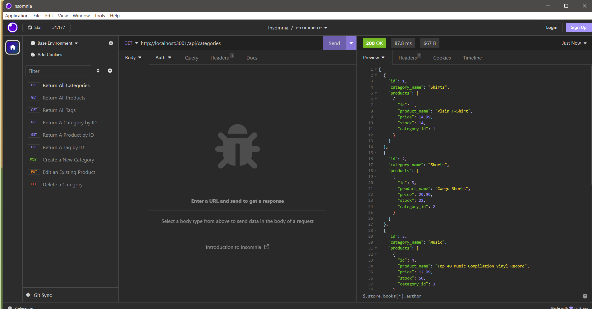

# Shop till you drop Ecommerce 
  by Brad Moleterno    
## Description
In a step to the eventual goal of creating a full stack application, Shop Till You Drop is a the backend of what could be a full stack application, servicing front end routes and using a MySQL database with Node.Js, Express, Sequelize. Dotenv provides a level of security by hiding passwords and other personal data. Using Insomnia, this application  utilizes sequilize to read, create, update, and delete data from a mysql2 database.
## Deployed Application URL
This app is not deployed on the internet. The repository for the code can be accessed at https://github.com/Boilermaker74/Shop-Till-You-Drop-E-Commerce-Back-End
## Table of Contents
* [Installation](#installation)
* [How to Use This Application](#how-to-use-this-application)
* [Walkthrough Video](#walkthrough-video)
* [Licenses](#Licenses)
* [Contributors](#contributors)
* [Testing](#testing)
* [Features](#features)
* [Languages and Technologies Used](#languages-and-technologies-used)
* [Dependencies](#dependencies)
* [Questions](#questions)

## Installation
Insomina must be install to access the application. MySQL2 must also be installed. Once these programs are installed, record the database name, the user name and password for Mysql database into the dot.env file.
.png) 

Make sure the file is renamed from .env.example to simply .env. 

Return to the application’s root directory. 

Type “npm install” to install the npm packages that are required to run the application. 

Enter the directory, “db”..

.png) 

In the "db" directory, enter the MySQL shell. From the MySQL shell, source the schema.sql file which will create the ecommerce database.
Type “exit” to exit the MySQL shell. 

.png) 

Next, type “node seeds/index.js” to seed the database. 

Finally type “node server.js” to launch the server. 

## How to Use This Application:
Since this application is only the back end of a full stack product. Insomnia, the API design tool, must be used to access the routes created by the application.
The user can view all categories in the database:

The user can also view all products:

The user can also view all tags:

The user can also view a particular category by id:

The user can also view a particular product by id:

The user can also view a tag by id:

The user is allowed to create a new category:

The user can change a category to a new descriptor:

The user can delete an entire category completely:

if an incorrect route is utilized, the user is presented with the wrong route message.

## Walkthrough Video:
A link to a video which shows the installation process and user's interactions can be found [HERE](https://app.screencastify.com/v2/watch/RFOCboapueeEhQLnVv7C)
## Licenses

## Contributors
Xandromus
## Testing
N/A
## Features
It saves data to a SQL database which can be acessed to read, write, ammend and delete data via routes set up in the program. It also uses dotenv to help hide sensitive personal data.
## Languages and Technologies Used

## Dependencies
Dotenv    version  16.3.1
Express   version  4.18.2
Mysql2    version  3.6.3
Sequelize version  6.35.0

## Questions
Please send your questions by email:  Bradm1492@gmail.com or visit [github/Boilermaker74](https://github.com/Boilermaker74).
